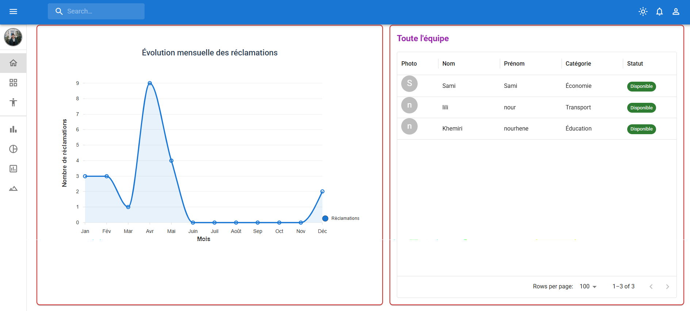
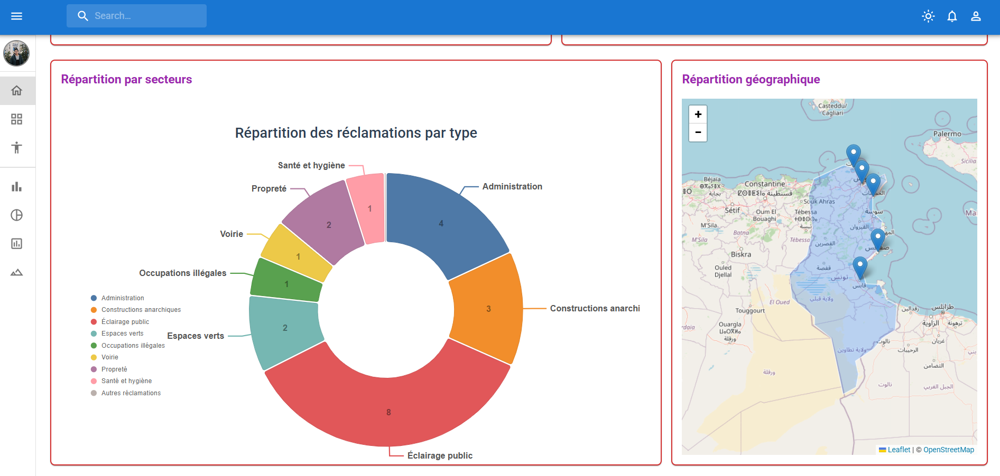

# Municipalite-app (Admin Dashboard)

This is the administrative component of the Baladia+ project, built with **React** and **Material UI**.

## Features

- **Reclamations Management**: View, track, and update the status of citizen complaints.
- **Dynamic Dashboard**: Visual overview of municipal activities.
- **Event Tracking**: Manage local events and festivals.
- **Team Management**: Coordinate municipal department staff.

## Technology Stack

- **Frontend**: React (Vite)
- **UI Framework**: Material UI (MUI)
- **Icons**: MUI Icons
- **Data Fetching**: Fetch API connecting to PHP backends

## Configuration

The application communicates with the database through PHP APIs located in the sibling `Municipalite/admin/` directory.

Base API URL: `http://localhost/Municipalite/admin`

## Development

```bash
# Install dependencies
npm install

# Start development server
npm run dev

# Build for production
npm run build
```

## Preview
| Dashboard | Complaints |
| :---: | :---: |
|  |  |

## Integration with Citizen Portal

This application is designed to be the destination for administrators logging in via the main `Baladia+` citizen portal. It expects the shared database to be populated by the portal's submission forms.