# Baladia+ - Municipal Management System

Baladia+ is a professional web platform designed for the municipality of **Sousse**, Tunisia (the "Pearl of the Sahel"). It serves as a digital bridge between the city administration and its citizens, offering streamlined access to municipal services, urban planning projects, and cultural events.

## 🚀 Features

- **Online Administrative Services**: Request birth certificates and other official documents digitally.
- **Reporting System**: Dedicated portal for citizens to report issues like public lighting, waste management, and road maintenance.
- **Urban Planning Portfolio**: Detailed overview of ongoing and completed architectural and urban developments.
- **Cultural & Tourism Guide**: Comprehensive list of festivals, historical sites (Medina, Ribat), and leisure activities in Sousse.
- **Admin Dashboard**: Secure backend for municipal agents to manage citizen requests and reclamations.

## 📁 Project Architecture

The project has been reorganized for better maintainability and clarity:

- `/`: Root directory containing main entry points (`index.html`, `login.php`).
- `/pages/`: Main application pages including administrative services and urbanism.
- `/pages/events/`: Detailed pages for cultural events and tourist attractions.
- `/assets/`: Centralized assets folder.
    - `/assets/css/`: Main and custom stylesheets (`style.css`).
    - `/assets/img/`: Images organized by category (homepage, festivals, etc.).
    - `/assets/vendor/`: Third-party libraries (Bootstrap, AOS, GLightbox, Swiper).
- `/admin/`: Backend PHP logic for administrative tasks.
- `/forms/`: PHP handlers for form submissions (contact, reclamations).

## 🛠️ Technologies Used

- **Frontend**: HTML5, Vanilla CSS3, JavaScript.
- **Backend**: PHP (for form processing and admin authentication).
- **Database**: MySQL (MariaDB).
- **Libraries**:
    - **Bootstrap 5**: For responsive layout and components.
    - **AOS (Animate On Scroll)**: For smooth entry animations.
    - **GLightbox**: For professional image and video galleries.
    - **Swiper**: For touch-enabled sliders and carousels.

## 🔧 Installation

1. Clone the repository to your local server directory (e.g., `www/` for WAMP or `htdocs/` for XAMPP).
2. Ensure you have a MySQL database named `municipalite` with the required tables (see `forms/contact.php` and `admin/api_reclamations.php` for schema hints).
3. Update the database credentials in `forms/contact.php` and `admin/login.php` if necessary.
4. Access the project via `localhost/Municipalite`.

## Images
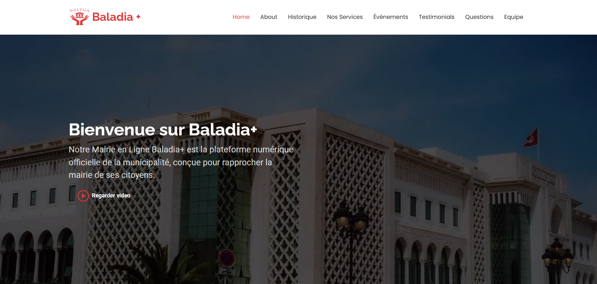
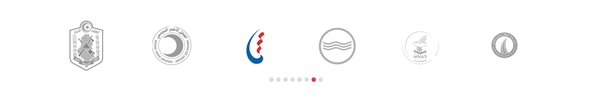
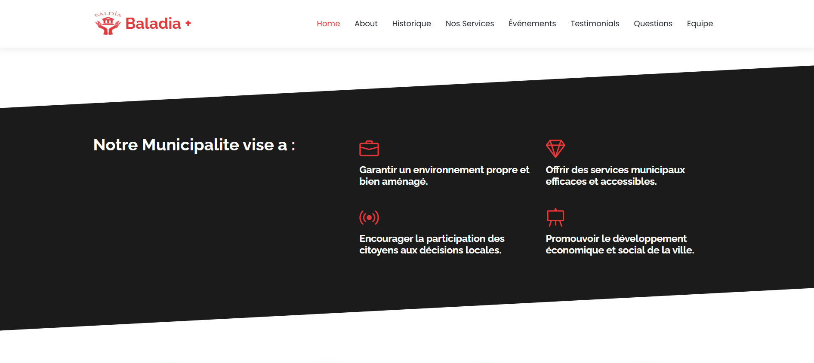
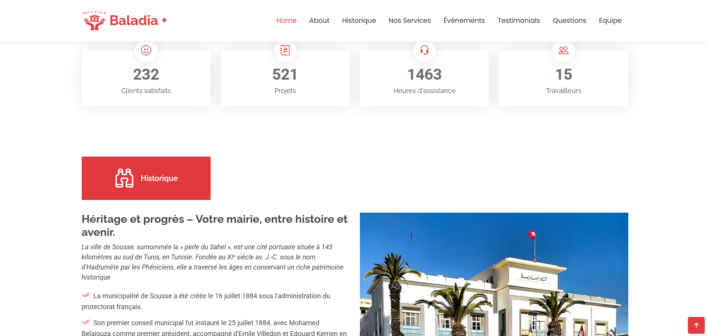
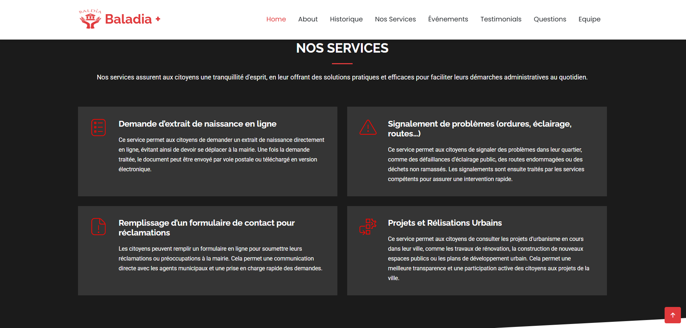
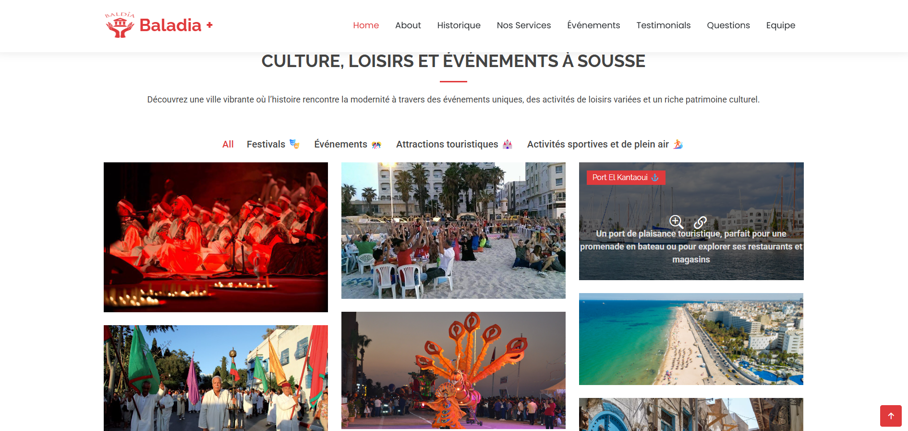
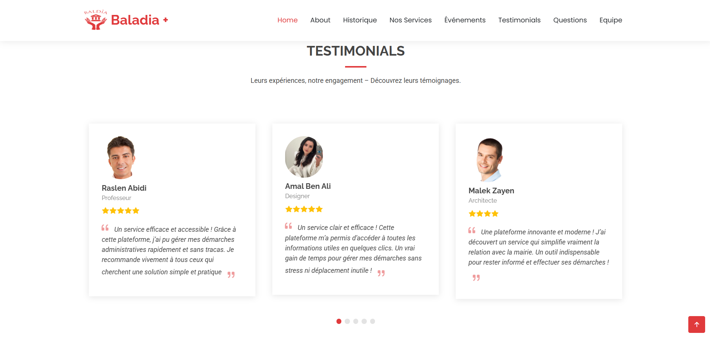
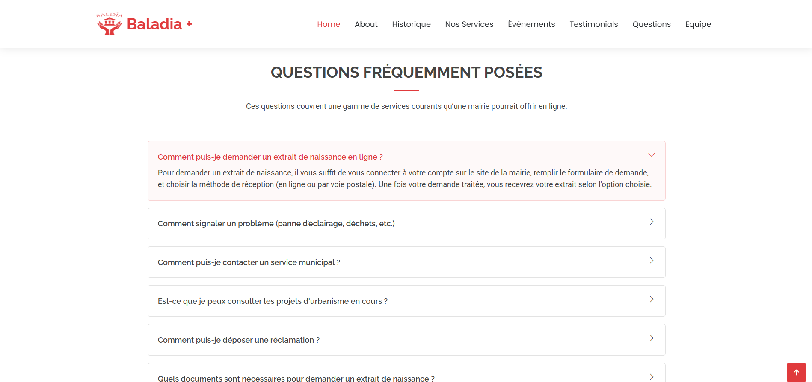
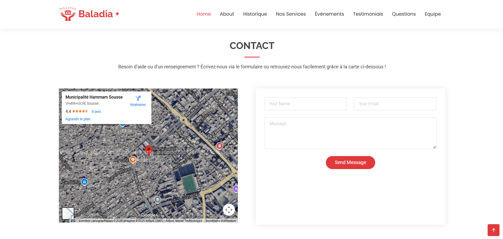
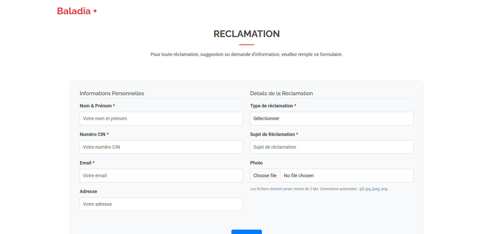
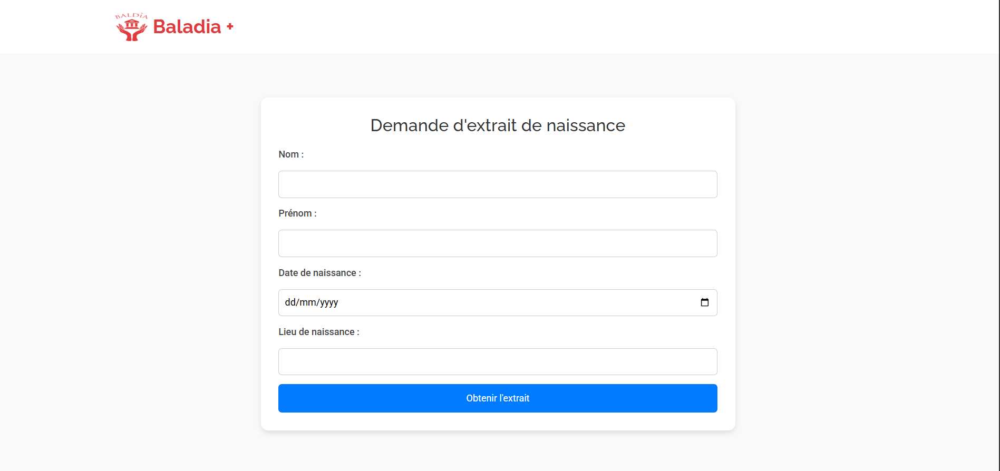
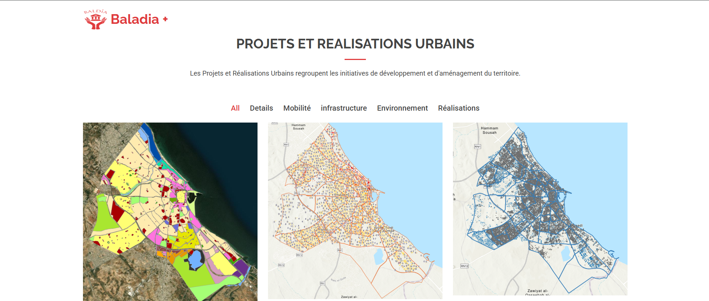
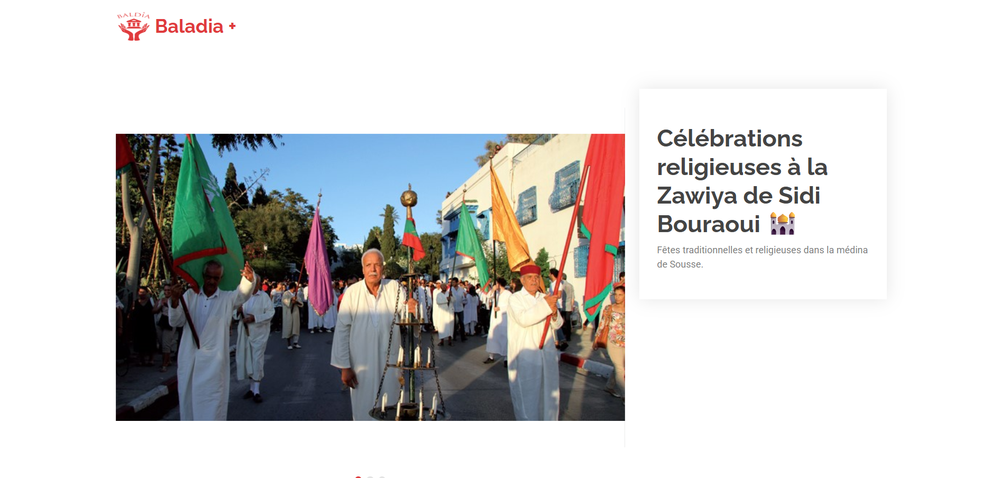
---
*Built with ❤️ for the city of Sousse.*
