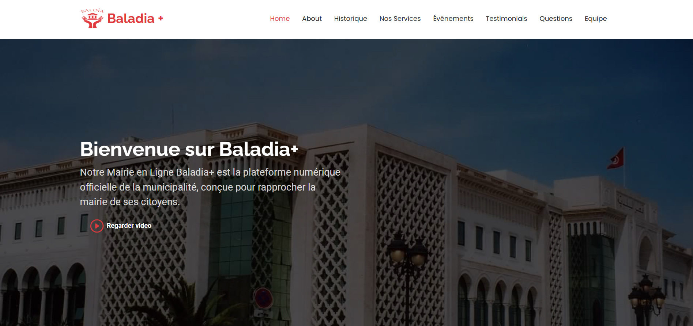
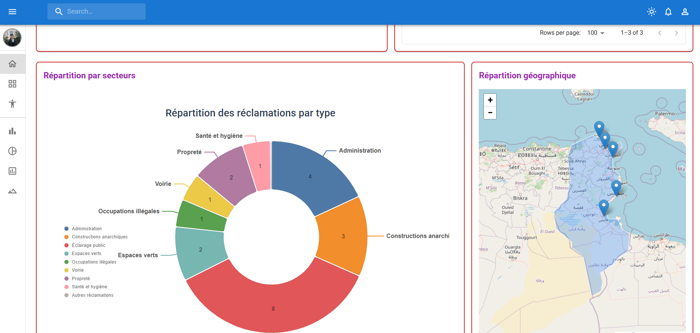

# Baladia+ 🏛️ | Municipal Management System

Baladia+ is a professional, integrated digital solution designed to bridge the gap between citizens and their municipality. It provides a seamless experience for citizens to access services and a powerful dashboard for administrators to manage city activities.

## 🚀 Overview

The project is split into two specialized applications that work in harmony:

1.  **Citizen Portal (`Municipalite`)**: A responsive, high-performance web portal for citizens to request documents, report issues, and stay updated on city events.
2.  **Admin Dashboard (`Municipalite-app`)**: A modern React-based administrative interface for municipality staff to monitor and respond to citizen needs.

---

## 📸 visual Gallery

### Admin Interface




## 🛠️ Technology Stack

| Component | technologies |
| :--- | :--- |
| **Frontend (Citizen)** | HTML5, CSS3, JavaScript, Bootstrap 5 |
| **Frontend (Admin)** | React.js, Material UI (MUI), Vite |
| **Backend** | PHP 8.x |
| **Database** | MySQL |
| **Dev Tools** | WAMP/XAMPP, npm |

---

## 📁 System Architecture

### 🛡️ Administration Flow
- **Authentication**: Secure login via `Municipalite/login.php`.
- **Seamless Transition**: After login, admins are automatically redirected to the React dashboard (`http://localhost:5173/`).
- **Data Sync**: Both apps consume and update a shared MySQL database via optimized PHP APIs.

### 📑 Key Modules
- **Reclamations (Complaints)**: Citizens report issues -> Admins track & resolve.
- **Service Requests**: Online requests for birth certificates and other documents.
- **Event Management**: Dynamic display of festivals and urban projects.
- **Staff Coordination**: Organizational view of municipality teams.

---

## ⚡ Setup & Installation

### 1. Database Configuration
1. Start your local server (WAMP, XAMPP, or Laragon).
2. Create a database named `municipalite`.
3. Import the SQL schema (if provided) or ensure tables `reclamations`, `users`, etc., are configured.
4. Update credentials in:
   - `Municipalite/forms/contact.php`
   - `Municipalite/admin/api_reclamations.php` (and other API files)

### 2. Citizen Portal
- Simply serve the `Municipalite/` directory through your local server.
- Access via `http://localhost/Baladia+/Municipalite/index.html`.

### 3. Admin Dashboard
```bash
cd Municipalite-app
npm install
npm run dev
```
- Access the dev server at `http://localhost:5173/`.

---

## 🔒 Security Note
For production deployment, ensure:
- Database passwords are encrypted using `password_hash()`.
- API endpoints are protected with JWT or Session validation.
- Input sanitization is strictly enforced on all forms.

---

Developed with ❤️ for Municipal Optimization.
